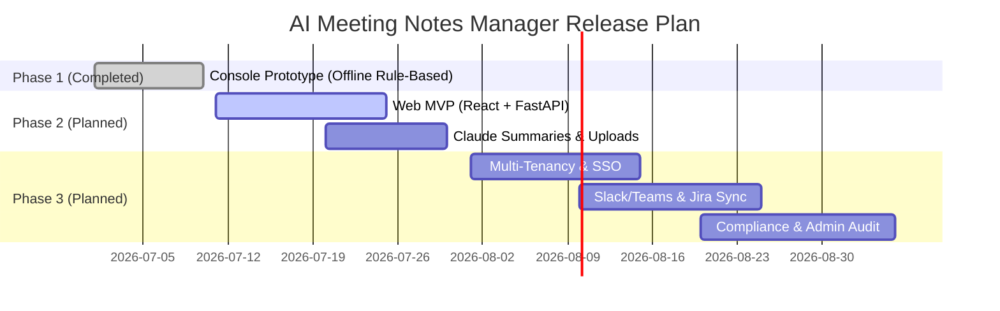

# Product Requirements Document (PRD) - AI Meeting Notes Manager

## 1. Executive Summary
The **AI Meeting Notes Manager** is an enterprise-grade solution designed to eliminate the administrative overhead of manual note-taking and prevent organizational memory loss. The system automatically ingests meeting transcripts (via live text capture or audio file uploads), utilizes Anthropic's Claude API to extract structured summaries, decisions, action items, and risks, and exports these results to team spaces or productivity tools. Security, role-based isolation, compliance retention policies, and high-availability offline fallbacks are core design goals.

---

## 2. Business Goals & Objectives
The business goals and success metrics are defined in detail within [SUCCESS_METRICS.md](file:///c:/New%20folder%20(3)/Day1_Docs/SUCCESS_METRICS.md). Key objectives include:
- **Reduce Administrative Time:** Save up to 80% of time spent writing, editing, and distributing meeting minutes.
- **Ensure Accountability:** Automate ownership assignment and due-date tracking for action items to reduce task abandonment.
- **Protect Intellectual Property:** Provide secure, multi-tenant isolation and role-based access for all meeting details.
- **Maintain High Uptime:** Guarantee summary service availability of 99.9% via a local fallback extractive engine.

---

## 3. Referenced Existing Documents
To avoid document duplication and maintain a clean repository structure, this PRD references the following source-of-truth files:
- **Product Overview & Scope:** [PROJECT_OVERVIEW.md](file:///c:/New%20folder%20(3)/Day1_Docs/PROJECT_OVERVIEW.md) & [PROJECT_SCOPE.md](file:///c:/New%20folder%20(3)/Day1_Docs/PROJECT_SCOPE.md)
- **Problem Statement & Market Study:** [PROBLEM_STATEMENT.md](file:///c:/New%20folder%20(3)/Day1_Docs/PROBLEM_STATEMENT.md) & [MARKET_RESEARCH.md](file:///c:/New%20folder%20(3)/Day1_Docs/MARKET_RESEARCH.md)
- **Target Audience & Journey Map:** [TARGET_USERS.md](file:///c:/New%20folder%20(3)/Day1_Docs/TARGET_USERS.md) & [USER_JOURNEY.md](file:///c:/New%20folder%20(3)/Day1_Docs/USER_JOURNEY.md)
- **MVP Prioritization Strategy:** [04_MVP_Design_Decisions.md](file:///c:/New%20folder%20(3)/Day3_Docs/04_MVP_Design_Decisions.md)
- **Functional Requirements (SRS):** [FUNCTIONAL_REQUIREMENTS.md](file:///c:/New%20folder%20(3)/Day1_Docs/FUNCTIONAL_REQUIREMENTS.md)
- **Non-Functional Requirements:** [NON_FUNCTIONAL_REQUIREMENTS.md](file:///c:/New%20folder%20(3)/Day1_Docs/NON_FUNCTIONAL_REQUIREMENTS.md)
- **User Stories & Acceptance Criteria:** [01_User_Stories.md](file:///c:/New%20folder%20(3)/Day4_Docs/01_User_Stories.md) & [02_Acceptance_Criteria.md](file:///c:/New%20folder%20(3)/Day4_Docs/02_Acceptance_Criteria.md)

---

## 4. Scope
The scope of the AI Meeting Notes Manager is split into the working MVP prototype, planned enhancements, and out-of-scope capabilities as established in [04_MVP_Design_Decisions.md](file:///c:/New%20folder%20(3)/Day3_Docs/04_MVP_Design_Decisions.md):
- **In-Scope (Must Have / MVP):** Email authentication, dashboard checklists, text transcript creation, rule-based and Claude-based summary generation, direct markdown/PDF export, full-text search, and local fallback summarization.
- **In-Scope (Should Have / Post-MVP):** Audio file uploads (MP3/WAV), transcription queues, search archiving, in-meeting editing, Slack/Teams channel publishing, and compliance data retention policies.
- **Out-of-Scope (Won't Have):** Real-time video stream recording, native mobile apps (iOS/Android), and advanced meeting participant talk-time analytics.

---

## 5. User Stories & Acceptance Criteria
- **User Stories:** Detailed in [01_User_Stories.md](file:///c:/New%20folder%20(3)/Day4_Docs/01_User_Stories.md). They cover 12 product modules including Authentication, Dashboard, Meeting CRUD, Search, AI Extractions, Actions & Decisions, Tagging, Export, Profile Settings, Notifications, Admin Controls, and Team Reports.
- **Acceptance Criteria:** Detailed in [02_Acceptance_Criteria.md](file:///c:/New%20folder%20(3)/Day4_Docs/02_Acceptance_Criteria.md). Written in Given-When-Then format, they cover success flows and critical security/system failures.

---

## 6. System Dependencies
- **Anthropic Claude API:** Required to extract structured decisions, action items, and summaries.
- **OpenAI Whisper API:** Required for audio-to-text transcription service.
- **SMTP Gateway:** Required for registration verification links, password resets, and due-date alerts.
- **Slack & Teams Webhook APIs:** Required for pushing highlight posts.
- **Jira & Asana OAuth APIs:** Required to create tickets from action items.

---

## 7. Risks & Mitigations

| Risk | Description | Impact | Mitigation Strategy |
|------|-------------|--------|---------------------|
| **AI Hallucinations** | Claude extracts incorrect actions or decisions from the meeting transcript. | High | Display confidence scores and include clickable source transcript excerpts for quick verification (`US-AI-002`). |
| **Data Leakage** | Sensitive corporate meeting contents are accessed by other tenants. | Critical | Enforce strict multi-tenant schema isolation, Row-Level Security (RLS) in PostgreSQL, and encrypt data at rest (`NFR-SEC-002`). |
| **API Costs & Rate Limits** | Heavy transcription and summarization calls incur high costs. | High | Set tenant quotas, rate-limit API actions, and use local rule-based/extractive fallback options where appropriate. |
| **API Outages** | Anthropic or Whisper API goes down, blocking meeting analysis. | High | Automatically fail close safely and activate the local extractive summarizer fallback (`US-AI-003`). |

---

## 8. Assumptions, Constraints & Constraints

### Assumptions
- Users have stable network connectivity for primary cloud features.
- Captured meeting transcript text quality is sufficient for summarization (e.g., standard grammar is used).
- Target customers utilize standard tools like Google Workspace or Azure AD for identity management.

### Constraints
- **Regulatory Compliance:** Must adhere to GDPR and CCPA rules regarding PII masking, data deletion, and data export.
- **Performance Budget:** Search results must return in < 2 seconds, and summaries of transcripts up to 5,000 words must compile in < 15 seconds.
- **Technical Stack:** Backend built on Python (FastAPI/SQLAlchemy) and PostgreSQL, frontend built on React/Vite, and dockerized services for cloud portability.

---

## 9. Release Plan

- **Phase 1 (Completed):** Command-line prototype demonstrating core capture, rule-based extraction, and markdown export.
- **Phase 2 (Planned Web MVP):** Web-based UI (React + FastAPI), local user authentication, text/document uploads, Whisper audio transcription, Claude summary integration, full-text search, and PDF exports.
- **Phase 3 (Enterprise Launch):** Azure/Google SSO integration, tenant configuration settings, automatic compliance retention sweeps, Jira/Slack integrations, semantic search, and audit trail logs.

---

## 10. Technical Considerations
- **Architecture:** Standard Clean Architecture with clear separations between database models, business services, API controllers, and the frontend view layer.
- **Database:** PostgreSQL for relational data consistency, utilizing the `pgvector` extension for semantic search vector storage.
- **Security BFF Pattern:** Implement a Backend-For-Frontend (BFF) architecture. The React frontend communicates strictly with the FastAPI backend. Session tokens and API keys are kept entirely on the server-side, secured with HttpOnly cookies, keeping secrets away from the client browser.
- **Content Security Policy (CSP):** The application will serve a strict CSP header blocking inline scripts and limiting connections to first-party endpoints and allowed API backends.
