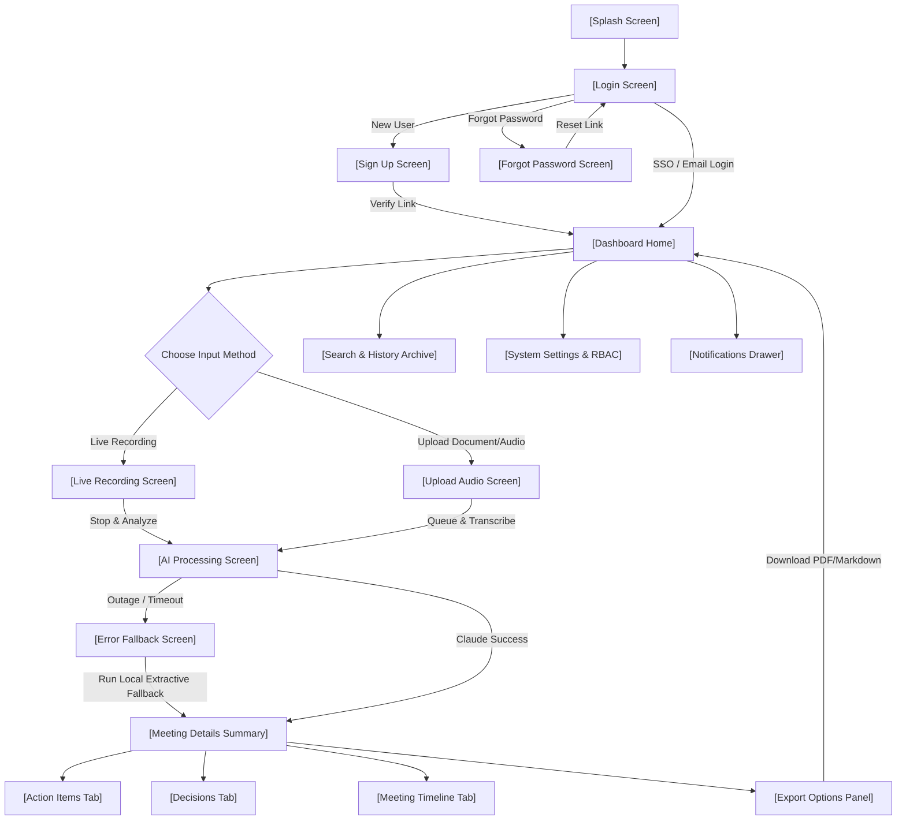

# Screen List, User Flow & Wireframe Notes

This document defines the interface layout structure and screen flows for the **AI Meeting Notes Manager**. It details how users traverse the SaaS platform and provides text-based wireframe mockups of the main views.

---

## 1. Complete Screen List

The SaaS platform consists of 22 screen layouts and states:

1. **Splash Screen:** Minimal logo loading screen with a pulsing progress indicator.
2. **Login Screen:** Credentials entry, "Remember Me" toggle, and Azure AD / Google Workspace SSO login buttons.
3. **Sign Up Screen:** Standard corporate email signup with password strength checker.
4. **Forgot Password Screen:** Request email for short-lived recovery token.
5. **Dashboard Home:** Core entry point containing:
   - Stats grid (Time saved, Meeting counts, Action completion rates)
   - 5 most recent meetings list
   - Aggregated personal pending action items checklist
6. **Live Recording Screen:** Real-time dialogue interface showing:
   - Audio waveform indicator and recording controls (Pause / Resume / Stop)
   - Real-time transcript box scrolling with speaker attributions
   - Immediate "AI Insight Detected" notification popups (toast triggers)
7. **Upload Audio Screen:** Drag-and-drop landing area supporting `.mp3`, `.wav`, `.docx`, and `.pdf` files.
8. **AI Processing Screen:** Spinner dashboard displaying status updates (e.g., "Uploading file...", "Transcribing audio...", "Claude extracting highlights...").
9. **Meeting Summary Tab:** View of a specific meeting's outcomes formatted in structured markdown.
10. **Action Items Tab:** Meeting-specific interactive checklists with owner names and due dates.
11. **Decisions Tab:** Ordered log of all choices approved during the meeting.
12. **Meeting Timeline Tab:** A clean, chronologically indexed view of the transcript.
13. **Search Page:** Full-text keyword and semantic concepts search engine results view.
14. **Meeting History (Archive):** List of all organization meetings with filter/sort attributes (tags, dates, participants).
15. **Team Workspace (RBAC Controller):** Workspace user directory listing, role modifier controls (Admin vs. Member), and invite options.
16. **Notifications Drawer:** Slide-out tray displaying recent alerts (mentions, tasks assigned, summary completions).
17. **User Profile Screen:** Manage personal avatar, name, and email.
18. **System Settings Screen:** Organization compliance controls (default data retention periods, timezone, API configuration, webhook keys).
19. **Export Options Panel:** Trigger overlay supporting DOCX, PDF, and raw Markdown downloads.
20. **Empty State Component:** Dashboard placeholder displays (e.g., "No meetings captured yet. Record your first conversation to begin!").
21. **Error State Screen:** Visual banner displaying fallback activations or integration failures.
22. **Success State Banner:** Interactive checkmarks for verified actions.

---

## 2. Platform User Flow

The following diagram maps the step-by-step user path from landing page to meeting notes validation and export:



---

## 3. Structural Wireframe Layouts

To establish a premium, Notion-like, minimalist visual structure, the system layout relies on a **Sidebar + Content Canvas** split.

### 3.1 Global Navigation & Dashboard Layout (Wireframe)

```
+--------------------------------------------------------------------------------+
|  [Logo] AI NOTES     | Search meetings (Ctrl+K)                [🔔]  [Avatar] |
+----------------------+---------------------------------------------------------+
|  📂 Meetings         |                                                         |
|  - All Notes         |  Welcome back, Priya!                                   |
|  - Recent (5)        |  +---------------------------------------------------+  |
|  - Starred           |  | STATS: [⏱️ 12h Saved]  [📝 24 Meetings] [📈 88% AC] |  |
|                      |  +---------------------------------------------------+  |
|  📌 Actions Board    |                                                         |
|                      |  RECENT MEETINGS                     PENDING ACTION ITEMS|
|  👥 Workspace        |  +------------------------+  +-----------------------+  |
|  - Team Members      |  | Sprint planning   07/13|  | [ ] Review API schema |  |
|  - Settings          |  | Marketing sync    07/11|  |     (Rahul - Tomorrow)|  |
|                      |  | Client checkin    07/10|  | [ ] Deploy dashboard  |  |
|  ⚙️ System Config    |  | Backend alignment 07/08|  |     (Priya - Friday)  |  |
|                      |  | Kickoff call      07/05|  |                       |  |
|                      |  +------------------------+  +-----------------------+  |
+--------------------------------------------------------------------------------+
```

### 3.2 Meeting Details & AI Summary View Layout (Wireframe)

```
+--------------------------------------------------------------------------------+
|  [Back to Archive]   | Sprint Planning - Week 15       [Export] [Sync to Jira] |
+----------------------+---------------------------------------------------------+
|                      |                                                         |
|  TABS:               |  [ SUMMARY ]    [ ACTIONS (6) ]    [ DECISIONS (1) ]    |
|                      |  -----------------------------------------------------  |
|  - Summary (Active)  |  ## Executive Summary                                   |
|  - Action Items      |  Priya outlined the week's goals focusing on the core   |
|  - Decisions         |  authentication module...                               |
|  - Timeline          |                                                         |
|                      |  ## Key Outcomes & AI Insights                          |
|                      |  🤖 **AI Insight: Decision (Confidence 95%)**           |
|                      |  "We decided to use JWT for token management."          |
|                      |  > Excerpt: Priya: We decided to use JWT... (L24)       |
|                      |                                                         |
|                      |  🤖 **AI Insight: Action Item (Confidence 90%)**         |
|                      |  "Rahul will review the API tomorrow."                  |
|                      |  > Excerpt: Amit: Rahul will review the API... (L32)    |
|                      |                                                         |
+--------------------------------------------------------------------------------+
```
